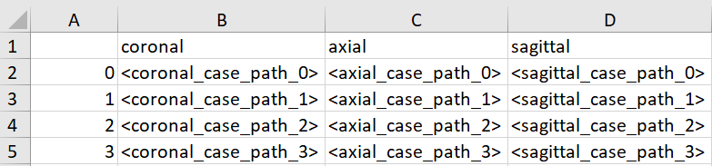

# SIMPLE
SIMPLE is a simultaneous multi-plane self-supervised learning method for isotropic MRI restoration from anisotropic data.


link for arxiv paper: https://www.arxiv.org/abs/2408.13065

## Installation

To use this project, use the following steps:

1. **Clone the Repository:**
   ```sh
   git clone https://github.com/TechnionComputationalMRILab/SIMPLE.git
2. **Install Dependencies (via conda)**
   ```sh
   pip install torch==2.3.1+cu118 torchvision --index-url https://download.pytorch.org/whl/cu118

   conda env create -f environment.yml
   
## Pre-Processing
You should provide a csv file that contains a table with 2 or 3 columns.
Each column represents the path for MRI case (DICOM/Nifti format) in specific plane. The column name can be 'coronal'/'axial'/'sagittal'.
Each row represents the cases for specific patient.

For eaxample:

## Training
This project contains 2 models: ATME and SIMPLE.

ATME is used as a preliminary stage for creating HR MRI images. 
In order to train SIMPLE, you should train first 2 ATME models for the coronal and axial planes separately and then evaluating each of them on the whole dataset.

- For training ATME, run the following command and specify the flags: --plane (coronal/axial) and --dataroot (the path for dicom files) . For evaluating ATME on the whole dataset immediately after the training, use the flag --TestAfterTrain, else run the test command for ATME.

   ```sh
   python train.py atme --plane=coronal --dataroot=<data_path>
   ```

- For training SIMPLE, run the following command and specify the flag --dataroot (the path for dicom files)
 
   ```sh
   python train.py simple --dataroot=<data_path>
   ```

## Evaluation
- for evaluating ATME, run the following command and specify the flags: --plane, --dataroot
   ```sh
   python test.py atme --plane=coronal --dataroot=<data_path>
   ```
- for evaluating SIMPLE, run the following command and specify the flag --dataroot
   ```sh
   python test.py simple --dataroot=<data_path>
   ```
## Contact

Please contact us on be.rotem@campus.technion.ac.il

## References
- Edgardo Solano-Carrillo, Angel Bueno Rodriguez, Borja Carrillo-Perez, Yannik Steiniger, and Jannis Stoppe. Look atme: the discriminator mean entropy needs attention. In Proceedings of the IEEE/CVF Conference on Computer Vision and Pattern Recognition, pages 787–796, 2023
- Phillip Isola, Jun-Yan Zhu, Tinghui Zhou, and Alexei A Efros. Image-to-image translation with conditional adversarial networks. In Proceedings of the IEEE conference on computer vision and pattern recognition, pages 1125–1134, 2017.
