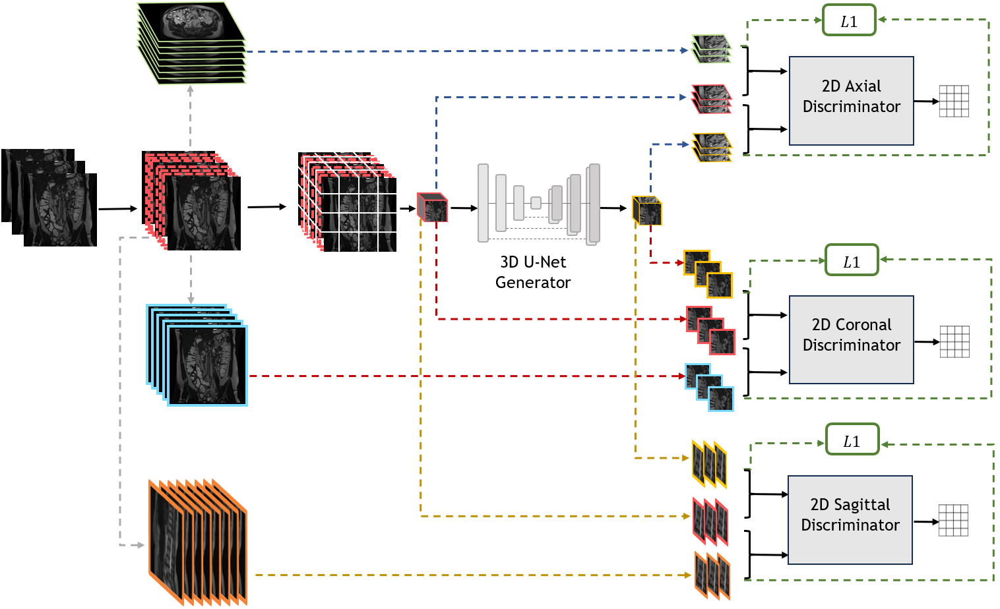

# SIMPLE
SIMPLE is a simultaneous multi-plane self-supervised learning method for isotropic MRI restoration from anisotropic data.



link for arxiv paper: https://www.arxiv.org/abs/2408.13065

## Installation

To use this project, use the following steps:

1. **Clone the Repository:**
   ```sh
   git clone https://github.com/TechnionComputationalMRILab/SIMPLE.git
2. **Install Dependecie (via conda)**
   ```sh
   conda env create -f environment.yml

## Training
This project contains 2 models: ATME and SIMPLE.

ATME is used as a preliminery stage for creating HR MRI images. 
In order to train SIMPLE, you should train first 2 ATME models for the coronal and axial planes sepearetly and then evaluating each of them on the whole dataset.

- For training ATME, run the following command and specify the flags: --plane (coronal/axial) and --dataroot (the path for dicom files) . For evaluating ATME on the whole dataset immediatly after the training, use the flag --TestAfterTrain, else run the test command for ATME.

   ```sh
   python train.py atme --plane=coronal --dataroot=<data_path>
   ```

- For training SIMPLE, run the following command and specify the flag --dataroot (the path for dicom files)
 
   ```sh
   python train.py simple --dataroot=<data_path>
   ```

## Evaluation
- for evaluating ATME, run the following command and specify the flags: --plane, --dataroot
   ```sh
   python test.py atme --plane=coronal --dataroot=<data_path>
   ```
- for evaluating SIMPLE, run the following command and specify the flag --dataroot
   ```sh
   python test.py simple --dataroot=<data_path>
   ```
## Contact

Please contact us on be.rotem@campus.technion.ac.il
